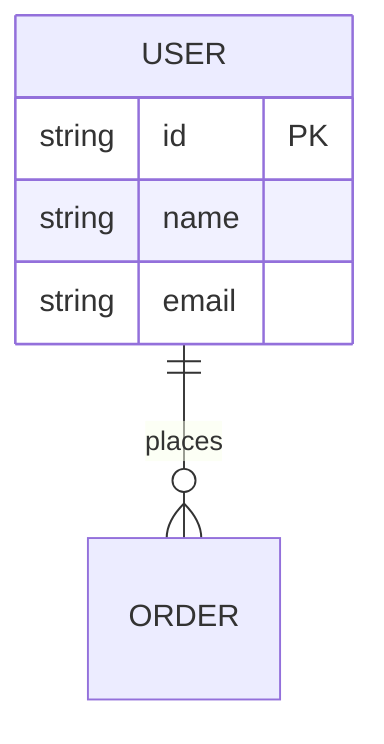

# {功能名称} - 需求文档

<!--
  PRD（Product Requirements Document）需求文档模板
  适用场景：新功能立项、功能迭代、需求评审
  使用说明：
    1. 复制本模板到 docs/requirements/REQ-{feature_name}.md
    2. 替换所有 {占位符} 为实际内容
    3. 删除不适用的章节（如纯后端功能可删除 5. UI/交互设计）
    4. 保留所有占位符待填写时，请使用 [待填写：xxx] 形式以便后续检索
-->

## 文档信息

| 属性 | 值 |
|------|-----|
| 文档编号 | REQ-{编号} |
| 版本 | v1.0 |
| 创建日期 | {YYYY-MM-DD} |
| 最后更新 | {YYYY-MM-DD} |
| 作者 | {作者} |
| 状态 | 草稿 / 评审中 / 已批准 / 已实现 / 已发布 |
| 优先级 | P0 / P1 / P2 |

---

## 1. 功能概述

### 1.1 简要描述
> 一句话描述该功能的核心价值。例：用户可通过手机号一键登录系统，无需注册即可访问基础功能。

### 1.2 关键词
{逗号分隔的关键术语，便于检索}

### 1.3 范围说明
- **包含**：{本次迭代覆盖的范围}
- **不包含**：{明确排除在外的内容}

---

## 2. 背景和目标

### 2.1 业务背景
{为什么要做这个功能？解决什么问题？基于哪些数据/调研？}

### 2.2 目标（SMART 原则）
- **目标 1**：{具体、可衡量、可达成、相关、有时限}
- **目标 2**：{...}

### 2.3 非目标
{明确声明此功能不做什么，避免范围蔓延}

### 2.4 成功指标
| 指标 | 当前值 | 目标值 | 度量方式 |
|------|--------|--------|----------|
| {指标名} | {值} | {值} | {如何度量} |

---

## 3. 功能需求

### 3.1 用户故事
| 编号 | 角色 | 需求 | 价值 |
|------|------|------|------|
| US-01 | 作为{角色} | 我希望{功能} | 以便{价值} |

### 3.2 功能清单
| 编号 | 功能名称 | 优先级 | 描述 |
|------|----------|--------|------|
| F-01 | {功能名} | P0 | {详细描述} |

### 3.3 业务规则
- BR-01：{业务规则描述}
- BR-02：{...}

### 3.4 边界条件与异常
| 场景 | 处理方式 |
|------|----------|
| {异常场景} | {如何处理} |

---

## 4. 非功能需求

### 4.1 性能要求
- 响应时间：{P95 < 200ms 等具体指标}
- 吞吐量：{QPS / TPS 等具体指标}
- 并发量：{同时在线 / 同时操作的用户数}

### 4.2 安全要求
- 认证：{所需的认证机制}
- 授权：{所需的权限控制}
- 数据：{敏感数据的加密、脱敏要求}

### 4.3 兼容性
- 浏览器：{支持的浏览器及版本}
- 系统：{支持的操作系统}
- 设备：{支持的设备类型}

### 4.4 可观测性
- 日志：{需要记录的关键操作日志}
- 监控：{需要的监控指标}
- 告警：{告警阈值与规则}

---

## 5. UI / 交互设计

### 5.1 页面布局
{描述或引用 Figma / Sketch 设计稿链接}

### 5.2 交互流程
```
{使用 Mermaid 流程图或文字步骤}
```

### 5.3 状态说明
| 状态 | 显示效果 | 触发条件 |
|------|----------|----------|
| {状态名} | {效果} | {条件} |

---

## 6. 数据模型

### 6.1 数据表
{使用 Mermaid ER 图或表格描述}



### 6.2 字段说明
| 字段名 | 类型 | 必填 | 默认值 | 说明 |
|--------|------|------|--------|------|
| {字段} | {类型} | 是/否 | {默认值} | {说明} |

### 6.3 索引设计
| 索引名 | 字段 | 类型 | 用途 |
|--------|------|------|------|
| {索引名} | {字段列表} | 唯一/普通 | {用途} |

---

## 7. 接口设计

> 详细接口定义见 [API 文档](../api/API.md)

### 7.1 接口清单
| 接口 | 方法 | 路径 | 描述 |
|------|------|------|------|
| {接口名} | POST | /api/xxx | {描述} |

---

## 8. 验收标准

### 8.1 功能验收
- [ ] AC-01：{验收条件}
- [ ] AC-02：{...}

### 8.2 测试用例
| 用例编号 | 描述 | 预期结果 |
|----------|------|----------|
| TC-01 | {测试步骤} | {预期结果} |

### 8.3 性能验收
- [ ] 在 {场景} 下，响应时间满足 {指标}
- [ ] 在 {压力} 下，错误率 < {阈值}

---

## 9. 上线计划

### 9.1 里程碑
| 里程碑 | 计划日期 | 实际日期 | 状态 |
|--------|----------|----------|------|
| 需求评审 | {日期} | {日期} | {状态} |
| 设计评审 | {日期} | {日期} | {状态} |
| 开发完成 | {日期} | {日期} | {状态} |
| 测试完成 | {日期} | {日期} | {状态} |
| 灰度发布 | {日期} | {日期} | {状态} |
| 全量发布 | {日期} | {日期} | {状态} |

### 9.2 灰度策略
{描述灰度比例、回滚条件、监控指标}

### 9.3 回滚方案
{遇到问题如何回滚，包括数据回滚}

---

## 10. 风险与依赖

### 10.1 技术风险
| 风险 | 影响 | 应对措施 |
|------|------|----------|
| {风险点} | 高/中/低 | {应对} |

### 10.2 外部依赖
- {依赖的第三方服务、内部团队、上游系统}

---

## 附录

### A. 相关文档
<!--
  示例（按需取消注释、改成实际路径）：
  - [API 文档](../api/API.md)
  - [架构文档](../architecture.md)
  - [设计稿](https://figma.com/...)
-->
- 待补充

### B. 变更历史
| 版本 | 日期 | 作者 | 变更说明 |
|------|------|------|----------|
| v1.0 | {日期} | {作者} | 初始版本 |
